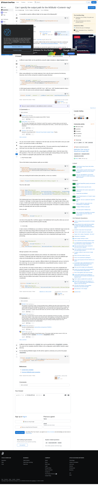

# Visited: https://stackoverflow.com/questions/10204370/can-i-specify-the-output-path-for-the-msbuild-content-tag
**Time:** Tue May  5 19:47:23 UTC 2026

## Screenshot

## Raw HTML
[page.html](./page.html)

## Downloaded Media (0 files)
_No media files downloaded_

## Other Links
- [#](#)
- [#comment101609730_47738053](#comment101609730_47738053)
- [#comment116407475_47738053](#comment116407475_47738053)
- [#comment137741646_12232067](#comment137741646_12232067)
- [#comment16450761_12232067](#comment16450761_12232067)
- [#comment16519226_12232067](#comment16519226_12232067)
- [#comment16519284_12232067](#comment16519284_12232067)
- [#comment86419209_47738053](#comment86419209_47738053)
- [#content](#content)
- [/](/)
- [/a/12232067](/a/12232067)
- [/a/47738053](/a/47738053)
- [/a/75601870](/a/75601870)
- [/beta/challenges](/beta/challenges)
- [/collectives](/collectives)
- [/collectives-all](/collectives-all)
- [/contact](/contact)
- [/feeds/question/10204370](/feeds/question/10204370)
- [/help](/help)
- [/help/how-to-answer](/help/how-to-answer)
- [/opensearch.xml](/opensearch.xml)
- [/posts/10204370/edit](/posts/10204370/edit)
- [/posts/10204370/ivc/050b?prg=a648002e-e747-45b4-8572-5fbb845f370b](/posts/10204370/ivc/050b?prg=a648002e-e747-45b4-8572-5fbb845f370b)
- [/posts/10204370/revisions](/posts/10204370/revisions)
- [/posts/10204370/timeline](/posts/10204370/timeline)
- [/posts/12232067/edit](/posts/12232067/edit)
- [/posts/12232067/revisions](/posts/12232067/revisions)
- [/posts/12232067/timeline](/posts/12232067/timeline)
- [/posts/47738053/edit](/posts/47738053/edit)
- [/posts/47738053/timeline](/posts/47738053/timeline)
- [/posts/75601870/edit](/posts/75601870/edit)
- [/posts/75601870/timeline](/posts/75601870/timeline)
- [/px.js?ch=1](/px.js?ch=1)
- [/px.js?ch=2](/px.js?ch=2)
- [/q/10204370](/q/10204370)
- [/questions](/questions)
- [/questions/10204370/can-i-specify-the-output-path-for-the-msbuild-content-tag](/questions/10204370/can-i-specify-the-output-path-for-the-msbuild-content-tag)
- [/questions/10204370/can-i-specify-the-output-path-for-the-msbuild-content-tag?answertab=scoredesc#tab-top](/questions/10204370/can-i-specify-the-output-path-for-the-msbuild-content-tag?answertab=scoredesc#tab-top)
- [/questions/12464350/output-path-and-msbuild](/questions/12464350/output-path-and-msbuild)
- [/questions/13571629/visual-studio-msbuild-set-content-output-directory](/questions/13571629/visual-studio-msbuild-set-content-output-directory)
- [/questions/18979690/msbuild-how-can-i-specify-the-output-file-path](/questions/18979690/msbuild-how-can-i-specify-the-output-file-path)
- [/questions/19000397/how-to-modify-the-output-path-in-the-prebuildevent-or-beforebuild](/questions/19000397/how-to-modify-the-output-path-in-the-prebuildevent-or-beforebuild)
- [/questions/19633531/configure-msbuild-output-path](/questions/19633531/configure-msbuild-output-path)
- [/questions/2989394/msbuild-outputpath-property-and-absolute-paths](/questions/2989394/msbuild-outputpath-property-and-absolute-paths)
- [/questions/30666802/set-output-path-for-msbuild-task](/questions/30666802/set-output-path-for-msbuild-task)
- [/questions/37077570/can-i-override-the-outputpath-of-a-project-on-the-solution-level-from-within-the](/questions/37077570/can-i-override-the-outputpath-of-a-project-on-the-solution-level-from-within-the)
- [/questions/4470308/csprojs-platform-specific-itemgroup-works-for-assembly-references-but-not-cont](/questions/4470308/csprojs-platform-specific-itemgroup-works-for-assembly-references-but-not-cont)
- [/questions/4470308/csprojs-platform-specific-itemgroup-works-for-assembly-references-but-not-cont?noredirect=1](/questions/4470308/csprojs-platform-specific-itemgroup-works-for-assembly-references-but-not-cont?noredirect=1)
- [/questions/748429/visual-studio-setup-project-with-all-files-from-a-folder](/questions/748429/visual-studio-setup-project-with-all-files-from-a-folder)
- [/questions/748429/visual-studio-setup-project-with-all-files-from-a-folder?noredirect=1](/questions/748429/visual-studio-setup-project-with-all-files-from-a-folder?noredirect=1)

## Stats
- Links: 204
- Media: 0
