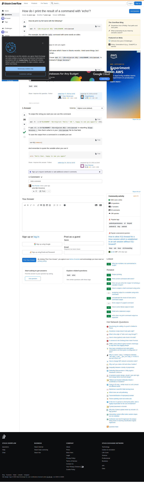

# Visited: https://stackoverflow.com/questions/29854979/how-do-i-print-the-result-of-a-command-with-echo
**Time:** Wed May  6 09:50:47 UTC 2026

## Screenshot

## Raw HTML
[page.html](./page.html)

## Downloaded Media (0 files)
_No media files downloaded_

## Other Links
- [#](#)
- [#comment120387630_29855186](#comment120387630_29855186)
- [#content](#content)
- [/](/)
- [/a/29855186](/a/29855186)
- [/beta/challenges](/beta/challenges)
- [/collectives](/collectives)
- [/collectives-all](/collectives-all)
- [/contact](/contact)
- [/feeds/question/29854979](/feeds/question/29854979)
- [/help](/help)
- [/help/how-to-answer](/help/how-to-answer)
- [/opensearch.xml](/opensearch.xml)
- [/posts/29854979/edit](/posts/29854979/edit)
- [/posts/29854979/ivc/5508?prg=07700d0f-7b24-477d-bc4f-f9c414163cf9](/posts/29854979/ivc/5508?prg=07700d0f-7b24-477d-bc4f-f9c414163cf9)
- [/posts/29854979/revisions](/posts/29854979/revisions)
- [/posts/29854979/timeline](/posts/29854979/timeline)
- [/posts/29855186/edit](/posts/29855186/edit)
- [/posts/29855186/revisions](/posts/29855186/revisions)
- [/posts/29855186/timeline](/posts/29855186/timeline)
- [/px.js?ch=1](/px.js?ch=1)
- [/px.js?ch=2](/px.js?ch=2)
- [/q/29854979](/q/29854979)
- [/questions](/questions)
- [/questions/19195756/how-can-you-echo-the-output-of-echoing-a-variable-in-bash](/questions/19195756/how-can-you-echo-the-output-of-echoing-a-variable-in-bash)
- [/questions/24419031/how-to-output-a-shell-command-using-echo](/questions/24419031/how-to-output-a-shell-command-using-echo)
- [/questions/27925625/assigning-output-to-a-variable-using-echo-command](/questions/27925625/assigning-output-to-a-variable-using-echo-command)
- [/questions/29299046/concatenate-the-result-of-echo-and-a-command-output](/questions/29299046/concatenate-the-result-of-echo-and-a-command-output)
- [/questions/29854979/how-do-i-print-the-result-of-a-command-with-echo](/questions/29854979/how-do-i-print-the-result-of-a-command-with-echo)
- [/questions/29854979/how-do-i-print-the-result-of-a-command-with-echo?answertab=scoredesc#tab-top](/questions/29854979/how-do-i-print-the-result-of-a-command-with-echo?answertab=scoredesc#tab-top)
- [/questions/39728969/echo-output-of-a-piped-command](/questions/39728969/echo-output-of-a-piped-command)
- [/questions/54100942/why-two-numbers-not-summarized-in-script](/questions/54100942/why-two-numbers-not-summarized-in-script)
- [/questions/54100942/why-two-numbers-not-summarized-in-script?noredirect=1](/questions/54100942/why-two-numbers-not-summarized-in-script?noredirect=1)
- [/questions/6151327/output-printing](/questions/6151327/output-printing)
- [/questions/62904846/how-to-echo-literal-output-in-bash](/questions/62904846/how-to-echo-literal-output-in-bash)
- [/questions/68594327/shell-echo-statement-output](/questions/68594327/shell-echo-statement-output)
- [/questions/69708778/echo-does-not-print-command-output-as-expected](/questions/69708778/echo-does-not-print-command-output-as-expected)
- [/questions/9772070/print-current-command-with-echo](/questions/9772070/print-current-command-with-echo)
- [/questions/ask](/questions/ask)
- [/questions/tagged/bash](/questions/tagged/bash)
- [/questions/tagged/echo](/questions/tagged/echo)
- [/tags](/tags)
- [/users](/users)
- [/users/258523/etan-reisner](/users/258523/etan-reisner)
- [/users/429476/alex-punnen](/users/429476/alex-punnen)
- [/users/4465820/diogosaraiva](/users/4465820/diogosaraiva)
- [/users/63550/peter-mortensen](/users/63550/peter-mortensen)
- [/users/login?ssrc=question_page&returnurl=https%3a%2f%2fstackoverflow.com%2fquestions%2f29854979%2fhow-do-i-print-the-result-of-a-command-with-echo%23new-answer](/users/login?ssrc=question_page&returnurl=https%3a%2f%2fstackoverflow.com%2fquestions%2f29854979%2fhow-do-i-print-the-result-of-a-command-with-echo%23new-answer)
- [?lastactivity](?lastactivity)
- [https://ajax.googleapis.com/ajax/libs/jquery/3.7.1/jquery.min.js](https://ajax.googleapis.com/ajax/libs/jquery/3.7.1/jquery.min.js)

## Stats
- Links: 169
- Media: 0
