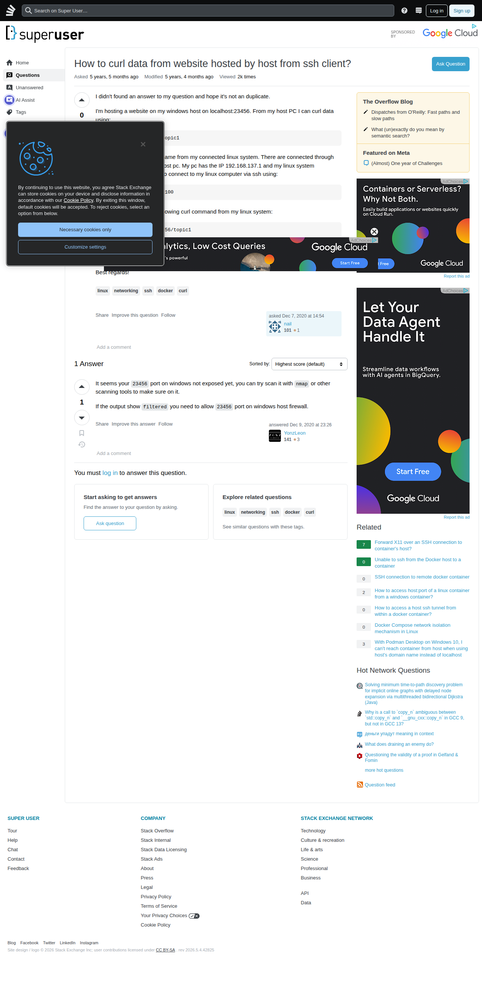

# Visited: https://superuser.com/questions/1608016/how-to-curl-data-from-website-hosted-by-host-from-ssh-client
**Time:** Tue May  5 19:04:57 UTC 2026

## Screenshot

## Raw HTML
[page.html](./page.html)

## Downloaded Media (1 files)
## Downloaded Media Files

## Other Links
- [#](#)
- [#content](#content)
- [/](/)
- [/a/1608686](/a/1608686)
- [/cdn-cgi/l/email-protection](/cdn-cgi/l/email-protection)
- [/cdn-cgi/scripts/5c5dd728/cloudflare-static/email-decode.min.js](/cdn-cgi/scripts/5c5dd728/cloudflare-static/email-decode.min.js)
- [/contact](/contact)
- [/feeds/question/1608016](/feeds/question/1608016)
- [/help](/help)
- [/opensearch.xml](/opensearch.xml)
- [/posts/1608016/edit](/posts/1608016/edit)
- [/posts/1608016/ivc/044b?prg=e0d51884-da5f-44d6-9169-a61e8a67d6ce](/posts/1608016/ivc/044b?prg=e0d51884-da5f-44d6-9169-a61e8a67d6ce)
- [/posts/1608016/timeline](/posts/1608016/timeline)
- [/posts/1608686/edit](/posts/1608686/edit)
- [/posts/1608686/timeline](/posts/1608686/timeline)
- [/px.js?ch=1](/px.js?ch=1)
- [/px.js?ch=2](/px.js?ch=2)
- [/q/1608016](/q/1608016)
- [/questions](/questions)
- [/questions/1202611/forward-x11-over-an-ssh-connection-to-containers-host](/questions/1202611/forward-x11-over-an-ssh-connection-to-containers-host)
- [/questions/1492353/unable-to-ssh-from-the-docker-host-to-a-container](/questions/1492353/unable-to-ssh-from-the-docker-host-to-a-container)
- [/questions/1608016/how-to-curl-data-from-website-hosted-by-host-from-ssh-client](/questions/1608016/how-to-curl-data-from-website-hosted-by-host-from-ssh-client)
- [/questions/1608016/how-to-curl-data-from-website-hosted-by-host-from-ssh-client?answertab=scoredesc#tab-top](/questions/1608016/how-to-curl-data-from-website-hosted-by-host-from-ssh-client?answertab=scoredesc#tab-top)
- [/questions/1610161/ssh-connection-to-remote-docker-container](/questions/1610161/ssh-connection-to-remote-docker-container)
- [/questions/1747151/how-to-access-hostport-of-a-linux-container-from-a-windows-container](/questions/1747151/how-to-access-hostport-of-a-linux-container-from-a-windows-container)
- [/questions/1816587/how-to-access-a-host-ssh-tunnel-from-within-a-docker-container](/questions/1816587/how-to-access-a-host-ssh-tunnel-from-within-a-docker-container)
- [/questions/1846429/docker-compose-network-isolation-mechanism-in-linux](/questions/1846429/docker-compose-network-isolation-mechanism-in-linux)
- [/questions/1852703/with-podman-desktop-on-windows-10-i-cant-reach-container-from-host-when-using](/questions/1852703/with-podman-desktop-on-windows-10-i-cant-reach-container-from-host-when-using)
- [/questions/ask](/questions/ask)
- [/questions/tagged/curl](/questions/tagged/curl)
- [/questions/tagged/docker](/questions/tagged/docker)
- [/questions/tagged/linux](/questions/tagged/linux)
- [/questions/tagged/networking](/questions/tagged/networking)
- [/questions/tagged/ssh](/questions/tagged/ssh)
- [/tags](/tags)
- [/tour](/tour)
- [/unanswered](/unanswered)
- [/users](/users)
- [/users/1053244/yonzleon](/users/1053244/yonzleon)
- [/users/1148740/nail](/users/1148740/nail)
- [/users/login?ssrc=question_page&amp;returnurl=https%3a%2f%2fsuperuser.com%2fquestions%2f1608016](/users/login?ssrc=question_page&amp;returnurl=https%3a%2f%2fsuperuser.com%2fquestions%2f1608016)
- [?lastactivity](?lastactivity)
- [https://ajax.googleapis.com/ajax/libs/jquery/3.7.1/jquery.min.js](https://ajax.googleapis.com/ajax/libs/jquery/3.7.1/jquery.min.js)
- [https://api.stackexchange.com/](https://api.stackexchange.com/)
- [https://blender.stackexchange.com/questions/346526/linear-warping-of-geometry-by-dragging-bounding-box-vertices-lattice-does-not-d](https://blender.stackexchange.com/questions/346526/linear-warping-of-geometry-by-dragging-bounding-box-vertices-lattice-does-not-d)
- [https://cdn.cookielaw.org/scripttemplates/gpp.stub.js](https://cdn.cookielaw.org/scripttemplates/gpp.stub.js)
- [https://cdn.cookielaw.org/scripttemplates/otSDKStub.js](https://cdn.cookielaw.org/scripttemplates/otSDKStub.js)
- [https://chat.stackexchange.com?tab=site&amp;host=superuser.com](https://chat.stackexchange.com?tab=site&amp;host=superuser.com)
- [https://chat.stackexchange.com?tab=site&host=superuser.com](https://chat.stackexchange.com?tab=site&host=superuser.com)
- [https://codegolf.stackexchange.com/questions/288035/how-many-smartphone-lock-style-pattern-combinations-are-there-given-a-configurat](https://codegolf.stackexchange.com/questions/288035/how-many-smartphone-lock-style-pattern-combinations-are-there-given-a-configurat)

## Stats
- Links: 148
- Media: 1
